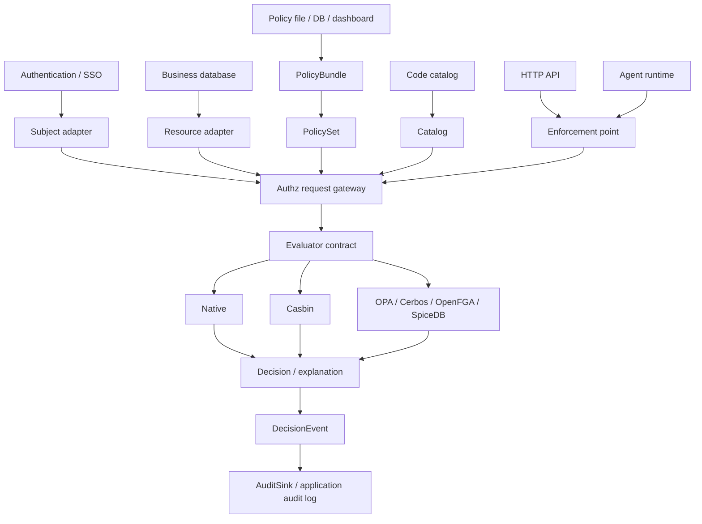
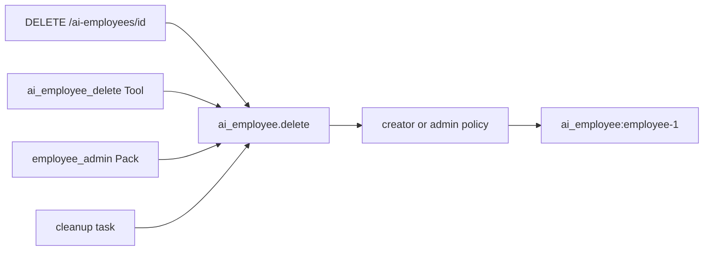

# Architecture

Agent Authz is deliberately split into a small core and application-owned
adapters.



## Responsibilities

### Identity provider

The host application authenticates a request and supplies stable identity
facts: ID, email, roles, positions, tenant, and actor type. Authz does not
manage passwords, sessions, SSO, or the employee directory.

### Catalog

`Catalog` is the contract registry. It answers:

- Which resource types exist?
- Which actions are valid for each resource?
- Which operations require a concrete resource?
- Which API, Tool, Pack, RAG, or task names map to an operation?

The catalog is also the source for a configuration UI. In `strict` mode it is
the allowed operation universe. In `advisory` and `off` modes it is metadata
only, so an external policy engine can use a richer vocabulary without being
blocked by a local inventory. Registering `document.read` never grants access.

### PolicySet

`PolicySet` contains reusable bindings. A binding selects an operation and a
template such as `relation`, `creator_only`, `owner_or_admin`,
`role_allowlist`, or `deny`. It may also carry a safe JSON condition, an
explicit allow/deny effect, obligations, and a policy version. The default
combiner is deny-overrides and the default decision is deny.

Selectors are normalized when registered. Values in one selector field are OR;
different populated selector fields are AND. This makes the dashboard form
predictable and avoids an unbounded custom expression language in the first
release.

### ResourceRegistry

`ResourceRegistry` is the adapter boundary between the SDK and business data.
The loader receives `(resource_id, subject, context)` and returns a resource
plus subject-relative relation facts. Each registry attaches its own provenance
token, so `Authz.production()` can reject caller-constructed resources and a
resource loaded by a different registry before policy evaluation. This is an
SDK integration guard, not a sandbox against arbitrary Python code already
running in the same process or proof that the loader's database query is
correct; the host still owns tenant, organization, ownership, and row-level
rules.

### Authz request gateway

`Authz.can()` resolves an operation, loads a resource if necessary, validates
resource identity, optional trusted-resource mode, the catalog, and tenant
boundary, then delegates to the configured `Evaluator`. `Authz.production()`
turns strict catalog, tenant context, and trusted-resource checks on together.
Every finalized decision carries a request ID, optional trace ID, contract
version, catalog fingerprint, and policy digest. When an external evaluator
returns a decision for a different operation, resource, or entrypoint, Authz
fails closed with `backend.contract_error` instead of silently accepting the
mismatched result. In the production profile, remote PDPs additionally need an
HTTPS standard-TLS transport preflight and an echoed request/catalog/policy binding
envelope; otherwise Authz denies with a backend binding/readiness error.
With no evaluator configured, it uses the embedded Native engine. `require()`
is the exception-raising enforcement helper. `explain()` serializes a decision
for a dashboard or audit event.

### Evaluator

An `Evaluator` answers only one question: does this normalized
`AuthorizationRequest` pass the selected policy engine? The SDK provides a
Native evaluator path, a Casbin adapter, and JSON adapters for OPA, Cerbos,
OpenFGA, SpiceDB, and AuthZEN-style PDPs. The evaluator must never execute a
Tool, load untrusted relations, or mutate business data.

## One operation, many entrypoints



Entrypoints are intentionally not treated as separate business capabilities.
An API can require a coarse route permission before loading a resource, while
the operation decision enforces ownership after the resource is trusted.

## Decision lifecycle

1. Authenticate the request in the host application.
2. Build one `Subject` for the request.
3. Resolve the operation from a typed resource/action or an entrypoint.
4. Load the resource through a trusted adapter when a resource ID is present.
5. Evaluate the policy bindings for the operation and request context.
6. For retrieval, run `CandidateFilter` before any selected candidate enters
   prompt context.
7. For a side effect, optionally issue/verify a short-lived `ExecutionPermit`
   and atomically consume its nonce through `PermitStore` with the current
   resource version.
8. Enforce `decision.allowed` before the business side effect.
9. Emit a privacy-safe `DecisionEvent` to an `AuditSink` or host pipeline.

The Native engine is synchronous and in-process. Remote evaluators use the same
normalized request shape and are deliberately explicit about network failure,
timeout, redirect refusal, selected-field projection, and fail-closed behavior.
The SDK does not hide database access or business side effects inside policy
evaluation.

For tenant-sensitive resources, set `tenant_required=True` when registering the
resource or `require_tenant_context=True` on `Authz`. A missing tenant on the
subject or resource is then denied rather than being treated as a public
resource by accident.

## Configuration lifecycle

```text
code catalog -> dashboard choices -> validated config -> PolicyBundle -> PolicySet
       ^                                      |
       |                                      v
resource adapters <--- decision request <--- host enforcement point
```

The code catalog defines the universe of valid names. A dashboard edits policy
bindings within that universe. `PolicySet.from_mapping(..., catalog=catalog)`
rejects unknown operations, duplicate IDs, and unsupported templates before a
new configuration is activated. `PolicyBundle` binds that configuration to a
catalog fingerprint, revision, schema/contract version, digest, and optional
HMAC proof. `PolicyBundleStore` is an in-memory atomic activation/rollback
primitive; persistence, approvals, and fleet rollout remain control-plane work.

## Local versus distributed deployment

The core is an embedded library. For a service-oriented deployment, keep the
same public contract and move the evaluator behind a PDP service only when
there is a real need for shared policy storage, centralized rollout,
cross-service consistency, or non-Python clients. The host-side PEP, Agent
runtime, and resource adapter boundaries remain useful in either topology.
