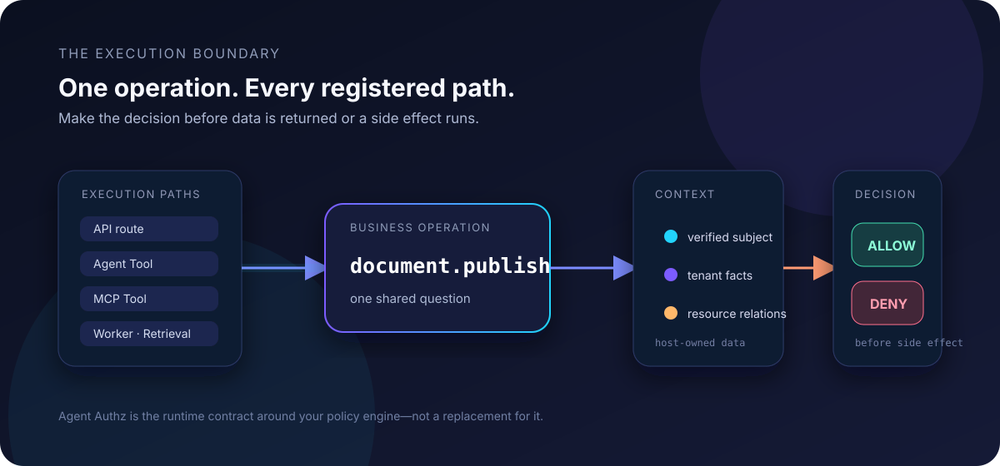

<h1 align="center">Agent Authz</h1>

<p align="center">
  <strong>让 Agent 的每一种执行方式，都经过同一次授权决策。</strong><br>
  业务操作只定义一次，在已登记的执行边界统一检查。
</p>

<p align="center">
  <a href="https://github.com/FrankPlusPlus/agent-authz/actions/workflows/ci.yml"></a>
  
  
  
</p>

<p align="center">
  <a href="#30-秒看到结果">30 秒看到结果</a> ·
  <a href="../quickstart.md">快速开始</a> ·
  <a href="../architecture.md">架构</a> ·
  <a href="../frameworks.md">集成</a> ·
  <a href="../production.md">生产边界</a> ·
  <a href="../../README.md">English</a>
</p>

<p align="center">
  
</p>

Agent Authz 是一个 Python 授权层，负责 Agent 动作真正执行前的最后一道检查。
它把已登记的执行路径映射为业务操作，从宿主应用拥有的数据源加载租户和关系事实，
并在返回受保护数据或产生副作用前给出明确的允许/拒绝结果。

它可以使用内置决策器，也可以接入已有策略后端。认证、业务数据、事务和策略控制平面
仍由你的应用负责。

它适合正在构建多租户 Agent 的 Python 团队：业务动作可能从 API、Tool、MCP 服务、检索或
后台任务进入系统。它只保护应用显式登记并路由到 guard 的路径，不会自动发现漏接的路径。

## 问题：一个操作，多个执行路径

`document.publish` 不只是一个 HTTP 接口。它也可能从 Agent Tool、MCP 服务、后台任务
或检索工作流进入系统。如果每个入口各写一套检查，权限就会漂移：

- API 有保护，但同一个 Tool 可以被直接调用；
- Tool 在发现阶段隐藏了，按名字直接调用时仍然执行；
- 检索请求被允许，却返回了另一个租户的数据；
- 后台任务悄悄使用了更宽的身份。

Agent Authz 把这些路径收敛为一个简单契约：

```text
已登记路径 → 业务操作 → 可信资源 → 允许 / 拒绝
```

## 30 秒看到结果

这个无额外依赖的示例会模拟 API、Python Tool、租户检查、检索过滤、审计事件和一次性
执行 Permit：

```bash
git clone --branch v0.7.0b6 https://github.com/FrankPlusPlus/agent-authz.git
cd agent-authz
python -m venv .venv
. .venv/bin/activate
python -m pip install -e .
python examples/secure_document_agent.py
```

输出是可以直接检查的安全结果：

```text
api_allowed=True          tool_allowed=True
tool_denied=True          cross_tenant_denied=True
permitted_chunk_ids=['chunk-public']
excluded_candidate_count=1  permit_status='consumed'
coverage_ready=True
```

完整示例见 [examples/secure_document_agent.py](../../examples/secure_document_agent.py)。

## 提供什么

| 原语 | 对开发者的结果 |
| --- | --- |
| **统一业务操作** | 把 API、Agent Tool、MCP Tool、任务和检索边界映射到同一个业务动作。 |
| **可信资源加载** | 租户、owner 和关系事实来自你的 loader，不来自模型输出或 Tool 参数。 |
| **最终执行 guard** | 被拒绝的 Tool 或路由不会进入受保护 callable。 |
| **CoverageManifest** | 让已声明的最终 guard 和数据边界可以在 CI 中检查。 |
| **CandidateFilter** | 在候选内容进入 prompt 前移除未授权检索结果。 |
| **决策与审计原语** | 保留 reason、obligation、策略版本和隐私安全的事件信息。 |
| **ExecutionPermit** | 将高风险动作绑定到短时、一次性的执行许可。 |

## 五分钟接入

先登记资源和策略，再让宿主应用的 loader 提供决策所需的事实：

```python
from authz_sdk import Authz, Catalog, PolicySet, ResourceRegistry, Subject

catalog = Catalog()
catalog.resource("document", actions=("read",), relations=("viewer",), tenant_required=True)

policies = PolicySet()
policies.bind(
    id="document_viewers_read",
    operation="document.read",
    template="relation",
    relations=("viewer",),
)

resources = ResourceRegistry()

documents = {
    "doc-1": {
        "tenant_id": "acme",
        "viewers": {"alice"},
        "body": "A private launch plan",
    }
}

def load_document(document_id, subject, context):
    row = documents.get(document_id)
    if row is None or row["tenant_id"] != subject.tenant_id:
        return None
    return {
        "id": document_id,
        "attributes": {"tenant_id": row["tenant_id"]},
        "relations": {"viewer": subject.id in row["viewers"]},
    }

resources.register("document", load_document)

authz = Authz.production(catalog, policies, resources)
decision = authz.can(
    Subject(id="alice", tenant_id="acme"),
    operation="document.read",
    resource_type="document",
    resource_id="doc-1",
)
assert decision.allowed
```

然后把同一个业务操作挂到最终 callable：

~~~python
from authz_sdk import AgentRuntime, protect_tool

runtime = AgentRuntime(authz)

@protect_tool(
    runtime=runtime,
    operation="document.read",
    subject=lambda call: call.kwargs["subject"],
    resource_type="document",
    resource_id=lambda call: call.kwargs["document_id"],
)
def read_document(*, subject, document_id):
    return documents[document_id]["body"]
~~~

## 适配现有技术栈

| 表面 | 状态 | 保护内容 |
| --- | --- | --- |
| Native core + `Authz.production()` | 可用 | Catalog、租户、可信资源、策略和最终决策契约 |
| FastAPI | 可用扩展 | handler 执行前的路由依赖 guard |
| Python Agent Tool | 可用 | 同步/异步 callable 执行前的 guard |
| MCP Python SDK 2.x | Beta 扩展 | 已登记 MCP Tool callable 执行前的 guard；认证仍由宿主负责 |
| Agno / LangGraph | 基础 wrapper | Tool 和 node 执行 guard |
| Casbin | 可用扩展 | 在统一请求/决策契约后复用已有 enforcer |
| OPA / Cerbos / OpenFGA / SpiceDB | 实验性 transport | fail-closed starter adapter，不是完整官方 client |
| RAG | 可用原语 | prompt 组装前的候选过滤 |

详见[完整支持矩阵](../frameworks.md)和[后端边界](../backends.md)。

## 为什么不直接只用策略引擎？

继续使用你信任的策略引擎。Agent Authz 负责策略引擎不会自动盘点的应用执行契约：

```text
API · Tool · MCP · 任务 · 检索
              ↓
       document.publish
              ↓
        一次可信资源决策
              ↓
          业务副作用
```

它不替代 Casbin、OPA、Cerbos、OpenFGA 或 SpiceDB，而是负责让同一个业务操作在不同
Agent 执行面之间保持一致。

## 边界要说清楚

Authz 自己作出决策时可以 fail-closed，但宿主应用仍必须：

- 验证调用者身份，并提供请求级、可信的 `Subject`；
- 从可信数据源加载租户、owner 和关系事实；
- 把最终 guard 放在副作用之前；
- 让所有相关路径经过已登记的 guard；
- 在需要时提供持久审计、query pushdown、Permit 密钥管理和故障策略；多 worker 的
  Permit 可使用 SDK 提供的 `RedisPermitStore`，最终业务事务校验仍由宿主负责。

这个 SDK 不是身份系统、关系数据库、向量数据库、Agent 框架、托管控制平面或同进程
插件沙箱。安全敏感场景请先阅读[威胁模型](../threat-model.md)和[生产指南](../production.md)。

<details>
<summary>发布物验证</summary>

GitHub Release 可用后，部署 wheel 前应验证校验和与 attestation：

```bash
gh release download v0.7.0b6 --repo FrankPlusPlus/agent-authz \
  --pattern 'agent_authz_sdk-0.7.0b6-py3-none-any.whl' --pattern WHEEL-SHA256SUMS
shasum -a 256 -c WHEEL-SHA256SUMS
gh attestation verify agent_authz_sdk-0.7.0b6-py3-none-any.whl \
  -R FrankPlusPlus/agent-authz
python -m pip install --no-deps agent_authz_sdk-0.7.0b6-py3-none-any.whl
```

</details>

## 文档与贡献

- [Quickstart](../quickstart.md)
- [架构](../architecture.md)
- [Agent Runtime](../agent-runtime.md)
- [MCP 集成](../mcp.md)
- [Coverage 证据](../coverage.md)
- [快速开始](../quickstart.md)：先用一个文档读取场景理解 Subject、Operation、Resource 和最终 guard
- [迁移指南](../migration.md)
- [与成熟授权系统的对比](../comparison.md)
- [路线图](../../ROADMAP.md)
- [安全策略](../../SECURITY.md)
- [供应链策略](../../SUPPLY_CHAIN.md)
- [English README](../../README.md)

提交 PR 前请阅读 [CONTRIBUTING.md](../../CONTRIBUTING.md)。

## 协议

Apache-2.0，见 [LICENSE](../../LICENSE)。
